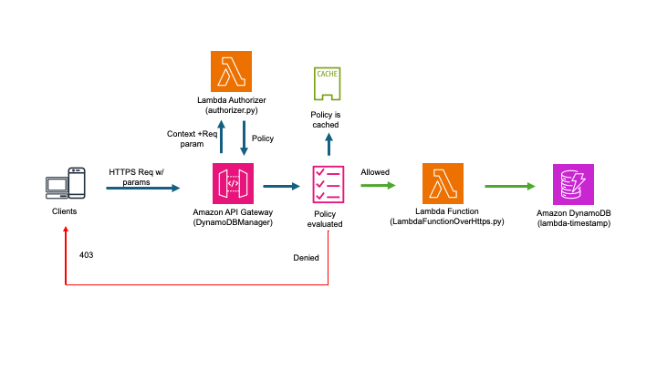

# Serverless Scalable CRUD Data API with AWS API Gateway and DynamoDB using Lambda Authorizer

## About

This repository sets up a serverless AWS API Gateway that invokes DynamoDB to perform create, read, update, and delete (CRUD) operations with a Lambda authorizer. The AWS deployment is managed using Terraform, making it easy to replicate.

The intention of this repository is to establish a serverless AWS API Gateway, enabling clients, such as Raspberry Pi or any internet-connected mobile devices, to send predefined structured data to an AWS DynamoDB database. This serverless architecture ensures scalability, low cost, and rapid development.
The deployment is coded in Terraform.

## Architecture Diagram

 
## Prerequisites

### AWS Account
The following AWS permissions are needed to use Terraform:

- AWSLambdaFullAccess
- IAMFullAccess
- AmazonAPIGatewayAdministrator
- CloudWatchLogsFullAccess

### Terraform
Terraform is an open-source infrastructure as code software tool created by HashiCorp. It enables users to define and provision datacenter infrastructure using a high-level configuration language known as HashiCorp Configuration Language (HCL) or optionally JSON.
Refer to the [Terraform documentation](https://developer.hashicorp.com/terraform/tutorials/aws-get-started/install-cli) for installation instructions.

### AWS CLI
Setting AWS credentials as environment variables is recommended:

    export AWS_ACCESS_KEY_ID="YOUR-ACCESS-KEY" 
    export AWS_SECRET_ACCESS_KEY="YOUR-SECRET-KEY" 

AWS region and account ID can be changed in Terraform file variables.tf 

### AWS Lambda
AWS Lambda is an event-driven, serverless computing platform provided by Amazon as part of AWS. It allows developers to run code without provisioning or managing servers, executing code in response to events, and automatically managing the computing resources required.

This setup uses one Lambda function as an authorizer to enhance the security of API calls. It verifies three elements in API to pass the authorization. You may customize them in authorizer.py and change the API parameters accordingly. 
- 'HeaderAuth1' == "headerValue1" 
- 'QueryString1' == "queryValue1"
- 'StageVar1' == "stageValue1"

Once authorization is passed, another Lambda function (LambdaFunctionOverHttps.py) is called by API Gateway to perform the actual CRUD operations on the DynamoDB table.

### API Gateway
Amazon API Gateway is a managed service that enables developers to create, publish, maintain, monitor, and secure APIs at any scale. A deployment stage named ‘test’ is used here, as shown in invoke URL.

Refer to [this tutorial](https://docs.aws.amazon.com/lambda/latest/dg/services-apigateway-tutorial.html)  for using API Gateway and Lambda function.

### DynamoDB
Amazon DynamoDB is a fully managed proprietary NoSQL database. DynamoDB offers a fast persistent key–value datastore with built-in support for replication, autoscaling, encryption at rest, and on-demand backup among other features.

A DynamoDB table “lambda-timestamp”, postfixed with a random number, is used to track incoming API data. The table primary key “time”, with type String, is mandatory in every API calls. Other fields are for example and can be customized in API. 
•	

## Deployment
1.	Initialize Terraform:

    terraform init 
2.	Apply the Terraform configuration:

    TF_VAR_account_id=your-id TF_VAR_aws_region=us-east-1 terraform apply

## Testing the API

### Invoke URL
This setup uses the default invoke URL from API Gateway. You can find this by navigating to the API Gateway in the AWS Console (API Gateway > APIs > DynamoDBOperations-id > Stages > Invoke URL). 
It looks like:

https://"gatewayid".execute-api."aws-region".amazonaws.com/"stage" 

Note: This URL may change every time you deploy. To keep the API Gateway URL constant while allowing different random IDs for resources, you can use a stage variable and map a custom domain name to your API Gateway, which is beyond the scope of this repository.

### CURL Example
    curl --http1.1 -X POST \
    'https://l8togsqxd8.execute-api.us-east-1.amazonaws.com/test/DynamoDBManager?QueryString1=queryValue1&StageVar1=stageValue1' \
    -H "HeaderAuth1: headerValue1" \
    -H 'Content-Type: application/json' \
    -d '{
            "operation": "create",
            "payload": {
                "Item": {
                    "time": "jun4 15:00",
                    "cpu temperature": "36"
                }
            }
        }'

## API Documentation
### Create Operation
To create a new item in the DynamoDB table:
Request:

    {
        "operation": "create",
        "payload": {
            "Item": {
                "time": "2024-06-04T12:00:00Z",
                "cpu temperature": "23",
                "device_id": "device123",
                "status": "active"
            }
        }
    }
 
### Read Operation
To read an existing item from the DynamoDB table:

    {
        "operation": "read",
        "payload": {
            "Key": {
                "time": "2024-06-04T12:00:00Z",
                "device_id": "device123"
            }
        }
    }

### Update Operation
To update an existing item in the DynamoDB table:

    {
        "operation": "update",
        "payload": {
            "Key": {
                "time": "2024-06-04T12:00:00Z",
                "device_id": "device123"
            },
            "UpdateExpression": "set #ct = :ct",
            "ExpressionAttributeNames": {
                "#ct": "cpu temperature"
            },
            "ExpressionAttributeValues": {
                ":ct": "25"
            }
        }
    }

### Delete Operation
To delete an existing item from the DynamoDB table:

    {
        "operation": "delete",
        "payload": {
            "Key": {
                "time": "2024-06-04T12:00:00Z",
                "device_id": "device123"
            }
        }
    }

### Echo Operation
To test the echo operation, which simply returns the payload provided:
    {
        "operation": "echo",
        "payload": {
            "message": "This is a test message."
        }
    }

## Checking DynamoDB Table Values
After performing operations, log in to AWS and check the DynamoDB table values to verify the changes.

## Client Side Code (Raspberry Pi)
An example python code (rpi-cpu-temp-120s.py) for Raspberry Pi is shown here to call API every two minutes with timestamp and CPU temperature (Celcius).

## Clean Up
To clean up the resources created by Terraform:
bash

    terraform destroy 
 

